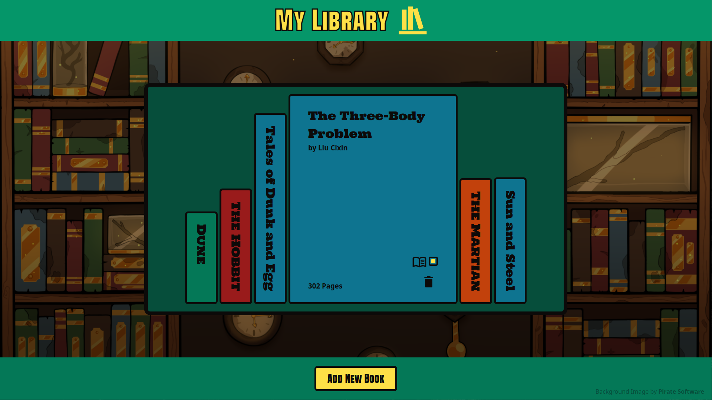

# My Library

Welcome to **My Library!** This web application helps you keep track of your books of interest, making it easy to manage your personal bookshelf.

## Features

- Interactive CSS: Hover over the shelved books to interact with their front covers.
- New Book Form: Easily add new books by providing details such as title, author, number of pages, and completion status.

## What I learned from the Project

- Utilizing form elements for user input.
- Creating engaging interactive CSS designs.

## Live Preview

Click [here](https://zukurai-kushal.github.io/library/) to view the live page.
